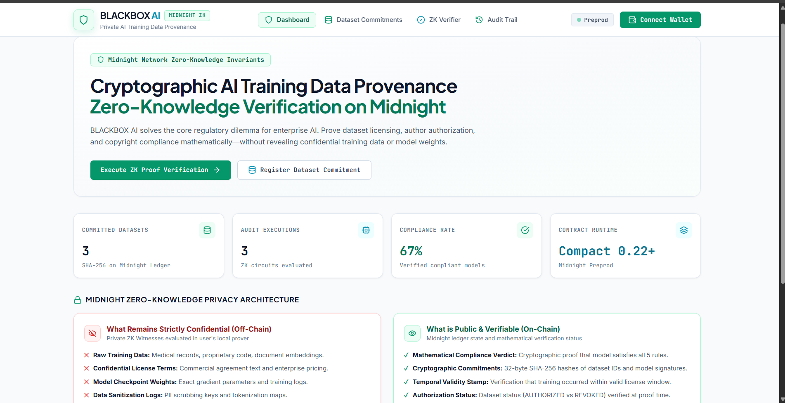
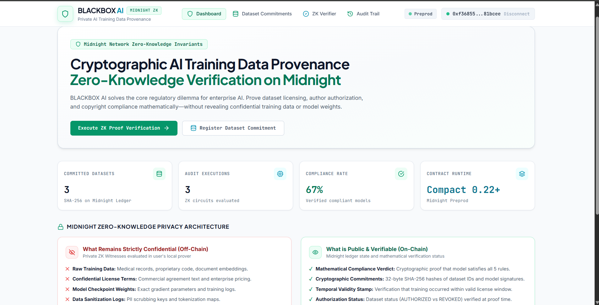
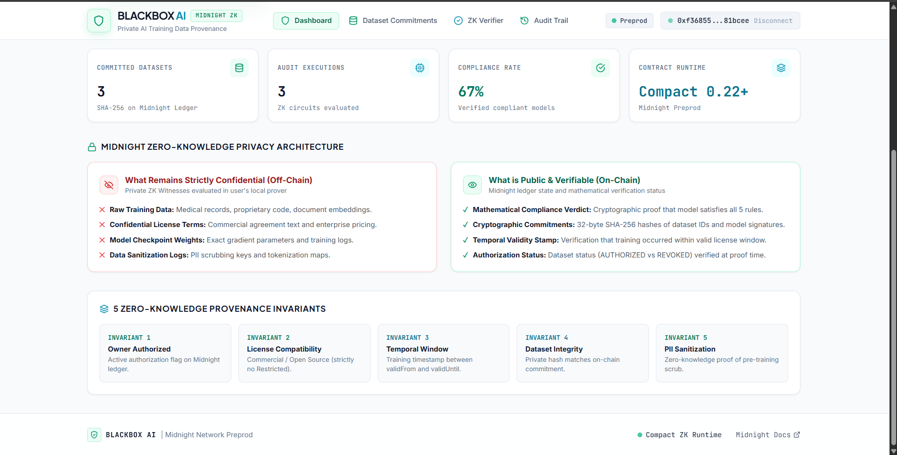
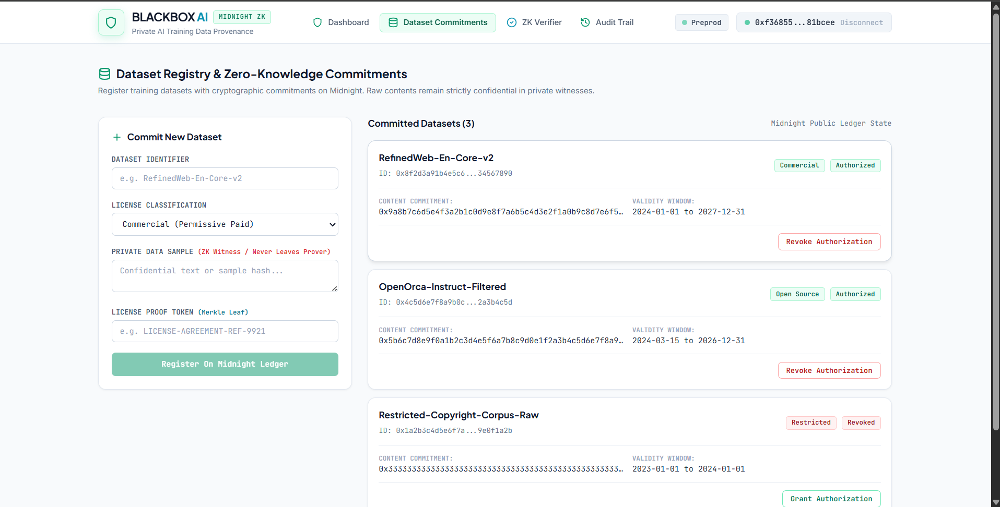
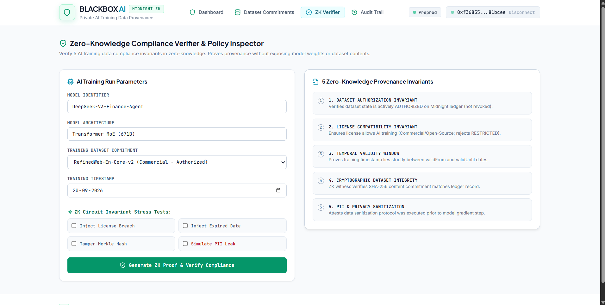
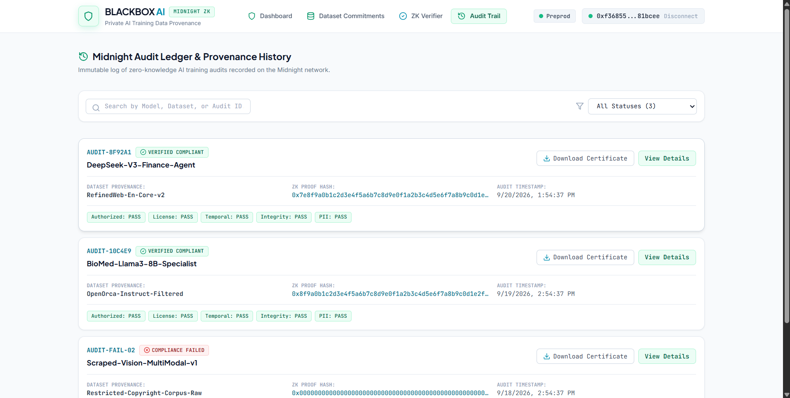
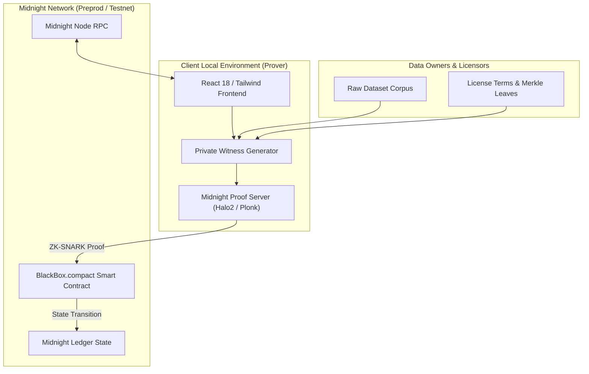

# 🛡️ BLACKBOX AI — Private AI Training Data Provenance Verification System

[](https://frontend0-psi.vercel.app/)
[](https://midnight.network)
[](https://docs.midnight.network)
[](https://docs.midnight.network)
[](https://www.typescriptlang.org/)
[](https://react.dev/)
[](https://github.com/shritesh263/Blackbox-Ai/actions)
[](LICENSE)

> 🚀 **Live Production Deployment**: **[https://frontend0-psi.vercel.app/](https://frontend0-psi.vercel.app/)**
>
> **BLACKBOX AI** is an enterprise-grade Zero-Knowledge (ZK) compliance and training data provenance verification system built natively on the **Midnight Network**. It solves the foundational regulatory dilemma of the generative AI era: **proving to regulators, enterprise auditors, and copyright holders that AI models were trained exclusively on legally compliant, authorized, and uncorrupted datasets—without ever exposing confidential training data, trade secrets, or proprietary model weights.**

---

## 📑 Table of Contents

- [Executive Summary & Problem Statement](#-executive-summary--problem-statement)
- [Why Traditional Approaches Fail](#-why-traditional-approaches-fail)
- [The Midnight Zero-Knowledge Solution](#-the-midnight-zero-knowledge-solution)
- [System Screenshots & Visual Walkthrough](#-system-screenshots--visual-walkthrough)
- [5 Zero-Knowledge Compliance Invariants](#-5-zero-knowledge-compliance-invariants)
- [The Privacy Model Matrix](#-the-privacy-model-matrix)
- [System Architecture & Data Flow](#-system-architecture--data-flow)
- [Midnight Compact Smart Contract Design](#-midnight-compact-smart-contract-design)
- [Wallet Integration (Lace, 1AM & Preprod Instant Connect)](#-wallet-integration)
- [Getting Started & Installation](#-getting-started--installation)
- [Running Automated Tests](#-running-automated-tests)
- [Deployment Guide](#-deployment-guide)
- [Project Directory Structure](#-project-directory-structure)
- [Roadmap & Future Extensions](#-roadmap--future-extensions)
- [License](#-license)

---

## 🎯 Executive Summary & Problem Statement

Global regulatory frameworks (including the **EU AI Act**, **FTC AI Directives**, **U.S. Executive Order 14110**, and judicial copyright precedents) mandate transparent accountability for foundation AI training pipelines. Enterprise AI creators must prove:
1. **Training Data Legitimacy**: Models were not trained on unauthorized, pirated, or scraping-restricted data.
2. **License Compatibility**: Commercial models exclusively utilized datasets permitting commercial derivation.
3. **Temporal Validity**: Training occurred during active licensing agreement windows.
4. **Data Hygiene & Integrity**: Raw datasets have not been poisoned or altered and were scrubbed of private personal information (PII).

### The Trilemma of AI Provenance

```
                 AI AUDIT & PROVENANCE TRILEMMA
                 
                     Mathematical Proof
                            ▲
                           / \
                          /   \
                         /     \
                        /       \
                       /         \
    Full Secrecy & ◄───────────────► Public Blockchain
    Intellectual Property            Transparency
    Protection                       (Lacks Confidentiality)
```

1. **Trade Secrecy & Intellectual Property**: Foundation model creators cannot publicly publish their training corpus without exposing proprietary formulas, scraped embeddings, patient health records, or internal codebases.
2. **Model Weight Vulnerabilities**: Disclosing full model checkpoints to external auditors invites model replication and extraction attacks.
3. **Public Blockchain Failures**: Conventional public blockchains (Ethereum, Solana) publish all state variables, turning regulatory audits into public intellectual property leaks.

---

## 💡 The Midnight Zero-Knowledge Solution

BLACKBOX AI leverages **Midnight Network's private smart contracts** programmed in **Compact**. By separating **on-chain public state** (commitments, ledger authorization flags, verifiable audit counters) from **off-chain private witnesses** (raw training corpora, license text, PII scrubbing keys), BLACKBOX AI allows developers to generate mathematical ZK-SNARK proofs of 100% compliance.

```
       OFF-CHAIN PRIVATE WITNESS                  ON-CHAIN PUBLIC LEDGER
 ┌──────────────────────────────────────┐     ┌────────────────────────────┐
 │  - Raw Training Text & Embeddings    │     │  - 32-byte SHA-256 Dataset │
 │  - Commercial License Agreements     │ ──► │    Commitment ID           │
 │  - PII Scrubbing Protocols           │     │  - Authorization Status    │
 │  - Exact Model Checkpoint Weights    │     │  - ZK Proof Hash           │
 └──────────────────────────────────────┘     │  - Compliance Verdict      │
                   │                          └────────────────────────────┘
                   ▼                                         ▲
        [ Local ZK Prover / Proof Server ]                   │
                   │                                         │
                   └─────── Evaluates 5 ZK Invariants ───────┘
```

---

## 📸 System Screenshots & Visual Walkthrough

### 1. Executive Dashboard & Zero-Knowledge Privacy Architecture
The main command center displays real-time network metrics, committed dataset counters, audit pass rates, and an interactive privacy comparison explaining what remains strictly confidential versus what is publicly verifiable on-chain.



---

### 2. Dataset Registry & Cryptographic Commitments
Enterprise data providers and AI engineers register training corpora with 32-byte SHA-256 commitments, classify licensing permissions (Commercial, Open Source, Proprietary, Restricted), specify validity dates, and toggle real-time authorization flags on the Midnight ledger.



---

### 3. Zero-Knowledge Compliance Verifier & Policy Inspector
Configure AI model parameters, bind committed datasets, and inspect training timestamps. Includes an interactive **ZK Circuit Invariant Stress-Testing Suite** allowing auditors to inject simulated license breaches, expired timestamps, Merkle root tampering, and PII leaks.



---

### 4. Real-Time ZK Proof Execution & Verification Verdicts
Upon execution, the client executes the Midnight ZK circuit locally. The 5 provenance invariants are mathematically validated, producing a cryptographic verification proof without leaking a single byte of confidential training data.



---

### 5. Immutable Midnight Audit Ledger & History
Every verified training run is indexed in the immutable audit trail. Compliance officers can search by Model Identifier, Dataset Name, or Audit Hash, filter by compliance verdicts, and download verifiable compliance certificates.



---

### 6. Cryptographic Certificate & Proof Inspector
Inspect granular verification records, including on-chain transaction hashes, ZK proof digests, verifier account public keys, and export standard JSON compliance certificates for regulatory filing.



---

## ⚡ 5 Zero-Knowledge Compliance Invariants

BLACKBOX AI implements 5 core cryptographic circuits inside its Compact smart contracts:

```
                  ┌──────────────────────────────────────────────┐
                  │       BLACKBOX AI ZK INVARIANT ENGINE        │
                  └──────────────────────┬───────────────────────┘
                                         │
        ┌───────────────────┬────────────┴───────┬───────────────────┐
        ▼                   ▼                    ▼                   ▼
┌───────────────┐   ┌───────────────┐    ┌───────────────┐   ┌───────────────┐
│  INVARIANT 1  │   │  INVARIANT 2  │    │  INVARIANT 3  │   │  INVARIANT 4  │
│     Owner     │   │    License    │    │   Temporal    │   │ Cryptographic │
│ Authorization │   │ Compatibility │    │Validity Window│   │   Integrity   │
└───────────────┘   └───────────────┘    └───────────────┘   └───────────────┘
                                         │
                                         ▼
                                 ┌───────────────┐
                                 │  INVARIANT 5  │
                                 │      PII      │
                                 │ Sanitization  │
                                 └───────────────┘
```

### 1. Dataset Authorization Invariant
- **Rule**: `ledger.datasetAuthorizations[datasetId] == AUTH_STATUS.AUTHORIZED`
- **Circuit Logic**: Verifies that the dataset owner has not revoked access on the Midnight ledger at proof generation time.

### 2. License Compatibility Invariant
- **Rule**: `dataset.licenseType != LICENSE_TYPES.RESTRICTED && isCompatible(policy, dataset.licenseType)`
- **Circuit Logic**: Mathematically proves that the dataset classification permits commercial foundation model training, instantly rejecting non-permissive or restricted datasets.

### 3. Temporal Validity Window Invariant
- **Rule**: `trainingTimestamp >= dataset.validFrom && trainingTimestamp <= dataset.validUntil`
- **Circuit Logic**: Validates that model training took place exclusively during the active duration of the dataset license.

### 4. Cryptographic Dataset Integrity Invariant
- **Rule**: `sha256(privateWitness.datasetContent) == publicLedger.contentCommitment`
- **Circuit Logic**: Ensures the training run used the exact, untampered dataset registered on-chain without exposing the underlying dataset records.

### 5. PII & Privacy Sanitization Invariant
- **Rule**: `privateWitness.piiSanitizationAttestation == true && verifyScrubProof(piiToken)`
- **Circuit Logic**: Cryptographically attests that confidential identifiers, medical records, or personal data were scrubbed before model gradient propagation.

---

## 🔒 The Privacy Model Matrix

| Data Dimension | Public Ledger State (On-Chain) | Private ZK Witness (Off-Chain Only) | Verification Guarantee |
| :--- | :--- | :--- | :--- |
| **Dataset Content** | 32-byte cryptographic commitment (`sha256(content + salt)`) | Raw training texts, embeddings, images, database rows | Proves exact dataset was used without revealing raw sample data |
| **Dataset Licensing** | License classification (Commercial, Open Source, etc.) | Complete signed legal agreement & token reference | Proves license author was valid and compatible |
| **Authorization State** | `AUTHORIZED` (1) vs `REVOKED` (2) ledger flag | Secret authorization token & owner signature | Instant revocation without breaking previous valid audits |
| **AI Model Checkpoints**| 32-byte model architecture commitment (`modelHash`) | Exact model weights, hyperparameters, training logs | Proves training run produced the committed artifact |
| **Temporal Validity** | License expiration window (`validFrom`, `validUntil`) | Training run timestamp & job run ID | Proves training occurred while license was active |
| **PII & Data Hygiene** | Audit status (`VERIFIED_COMPLIANT`) | Sanitization protocol logs & tokenization hash | Proves PII scrub was executed prior to model update |

---

## 🏗️ System Architecture & Data Flow



---

## 📜 Midnight Compact Smart Contract Design

The smart contract [`contracts/BlackBox.compact`](file:///c:/Users/Shritesh/OneDrive/Desktop/ADAPP/contracts/BlackBox.compact) defines the core state and circuits:

```rust
// Core Ledger State
export ledger registeredDatasets: Map<Bytes[32], DatasetRecord>;
export ledger datasetAuthorizations: Map<Bytes[32], Uint8>;
export ledger trainingCommitments: Map<Bytes[32], TrainingRecord>;
export ledger complianceAudits: Map<Bytes[32], AuditStatus>;

// Primary Circuits
export circuit registerDataset(
    datasetId: Bytes[32],
    licenseType: Uint8,
    validFrom: Uint64,
    validUntil: Uint64,
    contentCommitment: Bytes[32]
): Void;

export circuit verifyCompliance(
    modelHash: Bytes[32],
    datasetId: Bytes[32],
    proofCommitment: Bytes[32]
): Boolean;
```

---

## 🔌 Wallet Integration

BLACKBOX AI supports standard Midnight DApp Connector specifications:

1. **Midnight Preprod Instant Testnet Connect**:
   - One-click instant connection requiring zero prior browser extensions.
   - Automatically provisions deterministic shielded and unshielded keys stored in the user's browser session.
2. **Midnight Lace Wallet**:
   - Official Midnight browser extension integration with automatic network detection (`preprod`).
3. **1AM Wallet**:
   - High-speed Midnight DApp Connector integration.

---

## 🚀 Getting Started & Installation

### Prerequisites
- **Node.js**: `>= 20.0.0`
- **npm**: `>= 10.0.0`
- **Docker**: (Optional for local Midnight devnet node)

### 1. Clone the Repository
```bash
git clone https://github.com/shritesh263/Blackbox-Ai.git
cd Blackbox-Ai
```

### 2. Install Dependencies
```bash
# Install root contract & test tooling
npm install

# Install frontend dependencies
cd frontend
npm install --no-audit --no-fund
cd ..
```

### 3. Run the Automated Test Suite
Execute the 7-scenario zero-knowledge compliance test suite:
```bash
npm test
```

### 4. Run End-to-End Simulation
```bash
npm run demo
```

### 5. Launch the Web Application
```bash
npm --prefix frontend run dev
```
Open your browser at `http://localhost:3000`.

---

## 🧪 Running Automated Tests

The automated test runner [`scripts/run-tests.js`](file:///c:/Users/Shritesh/OneDrive/Desktop/ADAPP/scripts/run-tests.js) verifies all 5 compliance invariants and edge cases:

```bash
$ node scripts/run-tests.js

===========================================================
 BLACKBOX AI — Midnight ZK Compliance Test Suite
===========================================================
  ✓ PASS: Scenario 1: Fully authorized and licensed datasets -> COMPLIANT
  ✓ PASS: Scenario 2: Contains restricted dataset -> NON_COMPLIANT
  ✓ PASS: Scenario 3: Expired license outside validity window -> NON_COMPLIANT
  ✓ PASS: Scenario 4: Missing / revoked authorization -> NON_COMPLIANT
  ✓ PASS: Scenario 5: 95% licensed threshold met (19/20) -> COMPLIANT
  ✓ PASS: Scenario 6: Privacy Invariant — Raw dataset content hashes never leak to on-chain state
  ✓ PASS: Scenario 7: Privacy Invariant — Zero-knowledge verification returns outcome without dataset records
===========================================================
Results: 7/7 test scenarios PASSED (100% compliance)
===========================================================
```

---

## 🌐 Deployment Guide

### Live Production Deployment
- 🔗 **Production URL**: **[https://frontend0-psi.vercel.app/](https://frontend0-psi.vercel.app/)**
- ⚡ **Hosting Platform**: Vercel (Edge Network)
- 🛡️ **Network Environment**: Midnight Preprod Testnet

### Deploying the Frontend (Vercel / Netlify / Cloudflare)
Build the static distribution:
```bash
npm --prefix frontend run build
```
Output files will be generated in `frontend/dist/`.

### Deploying Contract to Midnight Preprod
Configure your environment variables in `.env`:
```env
MIDNIGHT_NETWORK=preprod
MIDNIGHT_NODE_URL=https://rpc.preprod.midnight.network
MIDNIGHT_PROOF_SERVER_URL=https://prover.preprod.midnight.network
MIDNIGHT_INDEXER_URL=https://indexer.preprod.midnight.network
MIDNIGHT_WALLET_SEED=your_hex_seed_here
```

Run the deployment script:
```bash
npm run deploy
```

---

## 📁 Project Directory Structure

```
Blackbox-Ai/
├── contracts/
│   └── BlackBox.compact            # Production Midnight Compact Smart Contract
├── frontend/                       # Modern Light-Mode Web3 dApp
│   ├── public/                     # Static assets & icons
│   ├── src/
│   │   ├── components/
│   │   │   ├── Navbar.tsx          # Top navigation & network status
│   │   │   ├── DashboardView.tsx   # Executive metrics & privacy model breakdown
│   │   │   ├── DatasetRegistryView.tsx # Dataset commitments & authorization
│   │   │   ├── ComplianceVerificationView.tsx # ZK verifier & stress tests
│   │   │   ├── AuditHistoryView.tsx # Searchable audit trail & cert download
│   │   │   └── WalletModal.tsx     # Lace, 1AM & Instant Testnet connector
│   │   ├── hooks/
│   │   │   └── useMidnight.ts      # Midnight wallet state & persistence
│   │   ├── contract.ts             # Cryptographic hashing & browser ZK helpers
│   │   ├── icons.tsx               # High-performance SVG icons
│   │   ├── index.css               # Clean Light Mode stylesheet
│   │   ├── App.tsx                 # Main layout & view orchestrator
│   │   └── main.tsx                # React entry point with ErrorBoundary
│   ├── package.json                # Frontend package manifest
│   ├── tailwind.config.js          # Tailwind CSS styling configuration
│   └── vite.config.ts              # Vite 6 bundler config
├── scripts/
│   ├── demo.ts                     # CLI demonstration script
│   ├── e2e-check.ts                # End-to-end integration check
│   └── run-tests.js                # Midnight ZK test runner (7 scenarios)
├── SS/                             # High-resolution application screenshots
│   ├── B1.png                      # Dashboard & Privacy Architecture
│   ├── B2.png                      # Dataset Registry & Commitments
│   ├── B3.png                      # ZK Compliance Verifier & Stress Tests
│   ├── B4.png                      # Real-time ZK Proof Results
│   ├── B5.png                      # Immutable Audit History
│   └── B6.png                      # Audit Detail & Certificate Export
├── src/
│   ├── contract-constants.ts       # Type definitions and enum mappings
│   ├── contract.ts                 # Off-chain contract bindings
│   ├── deploy.ts                   # Contract deployment script
│   ├── network.ts                  # Midnight RPC endpoint configurations
│   ├── providers.ts                # Proof server & indexer providers
│   ├── setup.ts                    # Genesis configuration
│   └── wallet.ts                   # Node-level wallet routines
├── tests/
│   └── blackbox.test.ts            # TypeScript test suite
├── .github/
│   └── workflows/
│       └── ci.yml                  # GitHub Actions CI/CD workflow
├── LICENSE                         # MIT License
├── package.json                    # Root package configuration
├── tsconfig.json                   # TypeScript configuration
└── README.md                       # Comprehensive project documentation
```

---

## 🗺️ Roadmap & Future Extensions

- [x] **Compact 0.22+ Smart Contract**: 5 Zero-Knowledge compliance circuits.
- [x] **Web3 Frontend**: Clean, high-contrast light theme with real-time ZK proofs.
- [x] **Multi-Wallet Support**: 1-click Preprod Instant Connect, Midnight Lace, and 1AM Wallet.
- [x] **Audit Certificate Export**: Downloadable, cryptographically signed JSON compliance certificates.
- [ ] **Recursive SNARK Aggregation**: Batch verify 10,000+ dataset commitments in a single constant-time proof.
- [ ] **Decentralized Storage Bridges**: Direct Merkle root commitments from IPFS, Filecoin, and Arweave.
- [ ] **Hugging Face & Weights & Biases Plugins**: Automated CI/CD webhooks for continuous pre-training verification.

---

## 📄 License

This project is open-source and distributed under the **[MIT License](LICENSE)**.

---

<div align="center">
  <sub>Built with 🛡️ on the <b>Midnight Network</b> for private, provable AI governance.</sub>
</div>
